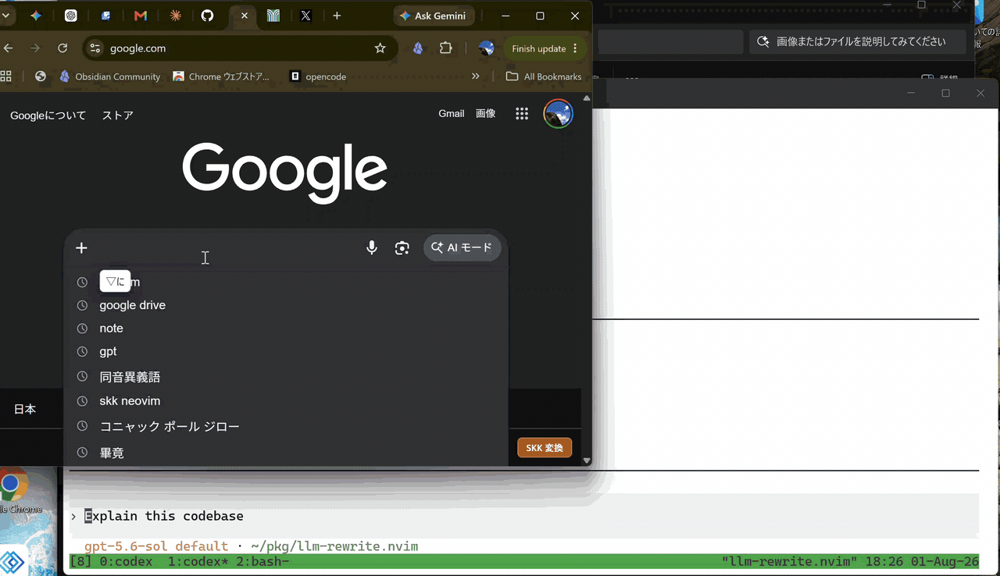

# SKK Lite for Chrome Inputs

Chromeのページ内入力欄だけで動く、SKK風の最小実装です。

同じ入力エンジンをGemiHub Desktop Pluginとしても利用できます。GemiHub版は
アプリ内の入力欄だけを対象とし、クリップボード入力窓は含みません。



管理者権限がないなどの理由で OS の IME を install できない環境でも、Chrome の入力欄で SKK を使えるようにすることを主な目的にしています。

辞書は [skk-dev/dict](https://github.com/skk-dev/dict) の継続的に整備されている SKK 辞書群に依存しています。`SKK-JISYO.L` を中心に専門辞書まで揃っていて非常に扱いやすい素晴らしいプロジェクトで、この拡張のビルド時の取得元はその配布ページ `https://skk-dev.github.io/dict/` です。

## 使い方

1. Chromeで `chrome://extensions` を開く
2. 右上の「デベロッパーモード」をON
3. 「パッケージ化されていない拡張機能を読み込む」
4. `build/chrome-skk-lite` を選択
5. 入力欄で試す

## キー操作

- `Ctrl+J`: かな入力へ切り替え（初期状態は無効）
- ショートカットが効かない場合は `chrome://extensions/shortcuts` で手動設定してください
- 候補表示中の `Ctrl+J`: 候補を確定（`SKK OFF` にはならない）
- `l`: かな入力から英数モード（`SKK OFF`）へ戻る
- `L`: 全角英数モードへ切り替え
- 小文字ローマ字: かな入力
- 大文字で開始: 変換開始
  - 例: `Nihongo` → `にほんご`
- 変換入力中は `▽にほんご` のように変換バッファを表示
- 変換入力中の大文字: 送り仮名あり変換
  - 例: `KanJi` → `感じ`（送り仮名入力中は `▽かん*じ` のように `*` を表示）
- `;`: Shift を使わない変換開始（sticky shift）。変換入力中の2回目の `;` は送り仮名の開始位置を指定
- `Space`: 候補変換 / 次候補
- 5候補目からは toast に候補一覧を表示し、`A` `S` `D` `F` `J` `K` `L` で直接選択（`Space`: 次ページ / `x`: 前ページ）
- 候補に辞書注釈がある場合は `候補 ※注釈` の形で toast に表示（注釈は確定文字列に含まれない）
- 最後に確定した候補は、同じ読みの次回変換で優先表示
- 通常入力で候補がない `Space`: ユーザー辞書登録モーダルを開く
- 登録モーダル内で候補がない `Space`: 変換バッファを維持
- 候補表示中の `x`: 前候補へ戻る
- 先頭候補で `x`: 候補を抜けてかな表示に戻る
- 候補表示中の `X`: 表示中の候補をユーザー辞書・学習履歴から削除
- 候補表示中の `Ctrl+G`: 候補をキャンセルして変換バッファに戻る
- 変換入力中の `Tab`: 過去に変換した読みから補完（押すたびに次の候補を巡回）
- 読みに数字を含めると数値変換（例: `▽だい5かい` → `第５回` / `第五回` など）
- 変換入力中の `>`: 接頭辞変換（例: `▽ちょう>` → `超`）
- かなモード・候補表示中の `>`: `▽>` の接尾辞入力を開始（例: `▽>てき` → `的`。候補表示中は確定してから開始）。リテラルの `>` は英数モードで入力
- 最終候補の次で `Space`: ユーザー辞書登録モーダルを開く
- 登録モーダルの `Escape`: モーダルを閉じて最後の候補表示に戻る
- 登録モーダル内の `Ctrl+J`: 入力中の変換を確定（モーダルは閉じない）
- 登録モーダル内の `q` / 変換中の `Enter`: 文字列だけ確定してモーダルは閉じない
- 登録モーダル内の `Backspace`: 確定済み文字が残っている間はモーダルを維持
- 登録モーダルでは `\u3042` のように入力して `Enter`: Unicode 文字を挿入（`¥u3042` / `￥u3042` でも可）
- 変換入力中の `q`: カタカナに変換して確定（`Ctrl+Q`: 半角カタカナで確定）
- 非変換時の `q`: カタカナ入力モードを切り替え（`SKK カナ`）
- 非変換時の `Ctrl+Q`: 半角カタカナ入力モードを切り替え（`SKK 半ｶﾅ`）
- `zh` / `zj` / `zk` / `zl`: `←` / `↓` / `↑` / `→`
- `z.` / `z,` / `z-` / `z/` / `z[` / `z]`: `…` / `‥` / `～` / `・` / `『` / `』`
- `z Space`: 全角スペース
- 空のかな入力状態で `/`: Abbrev モード（`▽/word`）へ切り替え
- Abbrev モード中の `Space`: 入力した文字列を辞書検索し、未登録なら単語登録を開く
- Abbrev モード中の `//`: `/` を確定入力
- Abbrev モード中の `Backspace`: バッファを削除し、空の `▽/` からさらに押すとかな入力へ戻る
- `Enter`: 確定
- `Escape` / `Ctrl+[`：キャンセル

有効化後は画面右下に `SKK OFF` / `SKK かな` / `SKK カナ` / `SKK 半ｶﾅ` / `SKK 全英` / `SKK 略語` / `SKK 変換` / `SKK 候補` の状態表示が出ます。

## クリップボード入力窓

Chrome のアドレスバー、新規タブの検索欄、`chrome://` ページなど、拡張機能の content script が入れない場所ではページ内 SKK 入力は使えません。その代わりに、`Ctrl+Shift+K` で SKK クリップボード入力窓を開けます。

1. `Ctrl+Shift+K` を押して入力窓を開く
2. 入力窓の中で通常と同じ SKK 操作で入力する
3. 変換中は `Enter` または `Ctrl+J` で候補または変換バッファを確定する
4. 候補表示中に次の文字入力を始めると、表示中の候補を確定してから続きの入力を開始する
5. `Ctrl+G` で候補をキャンセルして変換バッファに戻る。送り仮名入力中（候補未表示）の `Ctrl+G` は送り仮名を読みへ畳み込み、1 つの見出しとして再変換できる状態に戻す
6. `>` で通常入力欄と同じ接頭辞/接尾辞変換を行う
7. `q` / `Ctrl+Q`、`Tab` 補完、`X` 候補削除、`/` Abbrev、`zh` / `z Space` などの操作も通常入力欄と同じように使う
8. 候補がない場合、または最終候補の次で `Space` を押した場合は、単語登録ダイアログからユーザー辞書へ登録する。登録欄内でもローマ字かな入力と候補変換が使え、`q` / `Ctrl+Q` でカタカナ／半角カタカナ、`l` で英数、`L` で全角英数、`Ctrl+J` でかな入力へ戻る。モードラベルのクリックでもかな／英数を切り替えられる。変換中の `Enter` で文字列を確定してから、もう一度 `Enter` で登録する
   - 送り仮名が揃うと登録欄内でも自動で候補変換する
   - 登録欄内の `Ctrl+G` は 候補 → 変換中 → ローマ字 → ダイアログを閉じる、と 1 段階ずつ取り消す
   - 送り仮名あり変換の登録では読みを `はげ*る` のように表示（送り仮名は確定時に自動付与され、辞書には語幹のみ登録）
9. `l` で英数、`L` で全角英数、`Ctrl+J` でかなに戻る
10. `Shift+Enter` で改行する。変換中は現在の候補または変換バッファを確定してから改行する
11. 確定済み文字列の編集（Emacs 風）: `Ctrl+A` 行頭 / `Ctrl+E` 行末 / `Ctrl+F` `Ctrl+B` 1 文字前後 / `Ctrl+K` 行末まで削除（行末では改行も削除して連結）/ `Ctrl+U` 行頭まで削除 / `Ctrl+O` 全選択 / `Ctrl+X` 選択を切り取り / `Ctrl+Z` 元に戻す。`Escape` / `Ctrl+[` で変換をキャンセルする
12. 未変換状態で `Enter`、または `Copy` ボタンを押す
13. 確定済み文字列がクリップボードにコピーされ、入力窓が閉じる
14. アドレスバー、検索欄、Slack などの入力欄に貼り付ける

入力窓でも辞書候補、ユーザー辞書、候補の学習履歴、数字変換を使います。操作ヒントは状況に応じて `Space: convert / Enter: copy / Ctrl+O: select all` と `Space: next / Enter: commit / x: previous` を切り替えます。コピー後にアドレスバーへ自動貼り付けすることは Chrome の制限により行いません。

## 注意

これはOS IMEではなく、content scriptで入力欄を書き換える方式です。
Chromeの新規タブや初期表示のGoogle検索欄など、拡張機能のcontent scriptが入れないブラウザ内蔵ページではページ内入力は動きません。通常のWebページを開いて使うか、クリップボード入力窓で入力してから貼り付けてください。
パスワード欄、メール/URL/数字専用inputなどでは動かないようにしています。

## 自前でビルドする

GitHub Actions などは不要です。手元の環境で辞書を取得して、Chrome に読み込む拡張ディレクトリを生成できます。

前提:

- Node.js 22 以降
- `https://skk-dev.github.io/dict/` にアクセスできるネットワーク環境

手順:

1. このリポジトリのルートで次を実行します。

   ```sh
   node build_extension.js
   ```

2. ビルドが終わると `build/chrome-skk-lite` が生成されます。

3. Chrome で `chrome://extensions` を開き、「パッケージ化されていない拡張機能を読み込む」から `build/chrome-skk-lite` を選択します。

`node build_extension.js` は次を行います。

- `https://skk-dev.github.io/dict/` から指定した `SKK-JISYO.*.gz` を取得
- `compiled/dictionary.json` を再生成
- Chrome にそのまま読み込める最小構成を `build/chrome-skk-lite` に出力

`build/chrome-skk-lite` に入るのは、拡張実行に必要なファイルと `compiled/dictionary.json` だけです。

### GemiHub Desktop Plugin

Gemihub DesktopというAI機能つきメモ、ファイル管理アプリにも対応しています。[gemihub-desktop](https://github.com/takeshy/gemihub-desktop)
公開済みReleaseは、GemiHub Desktopの `Settings > Plugins` で
`takeshy/chrome-skk-lite` を指定するとpreview・installできます。Pluginを有効にした後、
アプリ内の入力欄で `Ctrl+J` を押すとSKKかな入力へ切り替わります。

ローカルでPlugin配布物を作る場合は、辞書を生成した後に次を実行します。

```sh
node scripts/build_gemihub_plugin.js
```

`build/gemihub-skk-lite` に `manifest.json`、`main.js`、`dictionary.json` が生成されます。
GemiHub版は辞書をPlugin assetとして初回利用時に取得し、ユーザー辞書、候補の学習履歴、
状態表示の位置をWorkspaceのPlugin storageへ保存します。入力内容を外部へ送信しません。

使用する辞書を変更したい場合は、`dictionary_sources.json` の `dictionaries` を編集してから、同じコマンドを再実行してください。
